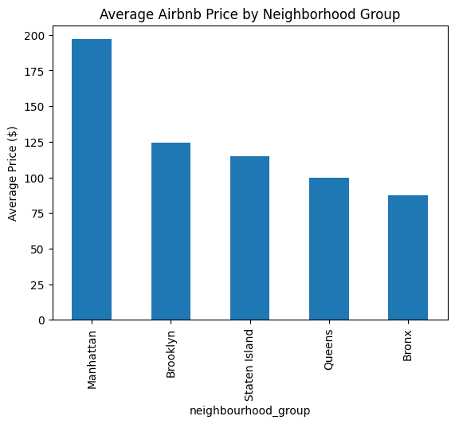
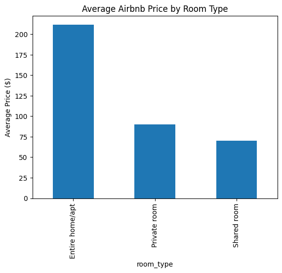
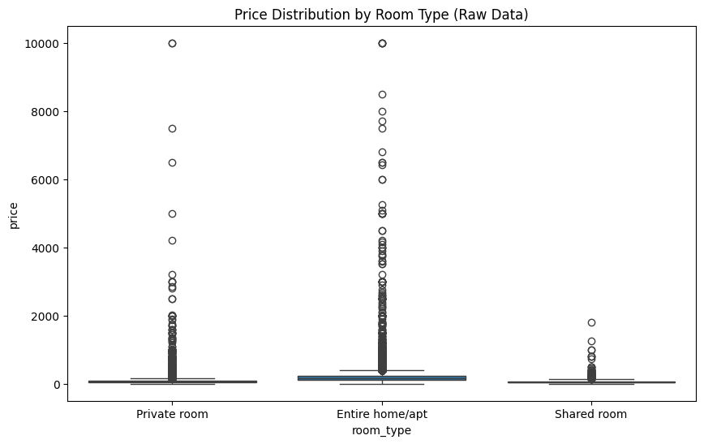
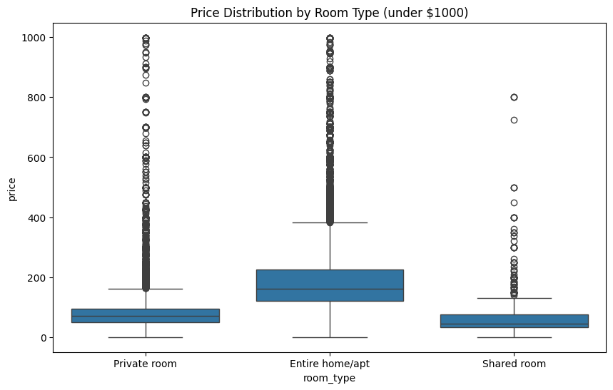
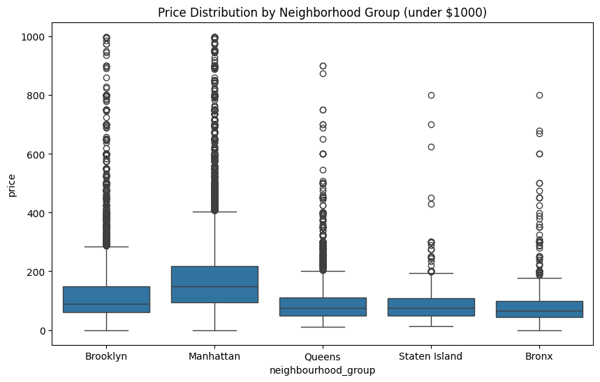

# Airbnb NYC Data Analysis

Analyze NYC Airbnb listings using Python (Pandas) to uncover pricing trends.

## Project Goal

The purpose of this project is to understand what factors affect Airbnb prices in NYC. The analysis explores how **neighborhood**, **room type**, and **availability** influence pricing patterns.

## Key Questions

- Which neighborhoods have the highest or lowest Airbnb prices?  
- How does room type influence price across different neighborhoods?

## Tools & Technologies

- **Python (Pandas, Matplotlib, Seaborn)** – Data analysis and visualization  
- **Jupyter Notebooks** – Interactive analysis  
- **Markdown / GitHub** – Project documentation and portfolio showcase  

## Data Source

- **Dataset:** NYC Airbnb listings  
- **Source:** [Inside Airbnb](http://insideairbnb.com/)  
- **File used:** `listings.csv`  

## Methodology

1. Loaded the raw CSV into Pandas and cleaned the data (handled missing values, removed outliers).  
2. Aggregated and analyzed listings by **neighborhood** and **room type** using Pandas.  
3. Created visualizations (bar charts, heat maps) using Matplotlib/Seaborn.  
4. Compiled insights into a report for quick understanding.  

## Getting Started
1. Clone the repository: `git clone <repo_url>`  
2. Install dependencies: `pip install -r requirements.txt`  
3. Open the Jupyter Notebook: `jupyter notebook`

## Dataset Overview

| id   | name                       | host_name   | neighbourhood_group | neighbourhood | room_type       | price |
|------|----------------------------|------------|------------------|---------------|----------------|-------|
| 2539 | Clean & quiet apt by park  | John       | Brooklyn          | Kensington    | Private room   | 149   |
| 2595 | Skylit Midtown Castle      | Jennifer   | Manhattan         | Midtown       | Entire home/apt| 225   |
| 3647 | Village of Harlem NYC      | Elisabeth  | Manhattan         | Harlem        | Private room   | 150   |
| 3831 | Cozy Brownstone Floor      | LisaRoxanne| Brooklyn          | Clinton Hill  | Entire home/apt| 89    |
| 5022 | Spacious Studio/Loft       | Laura      | Manhattan         | East Harlem   | Entire home/apt| 80    |

## Data Cleaning

RangeIndex: 48895 entries, 0 to 48894
Data columns (total 16 columns):

| #  | Column                          | Non-Null Count  | Dtype   |
|----|---------------------------------|----------------|---------|
| 0  | id                              | 48,895 non-null | int64   |
| 1  | name                            | 48,879 non-null | object  |
| 2  | host_id                         | 48,895 non-null | int64   |
| 3  | host_name                       | 48,874 non-null | object  |
| 4  | neighbourhood_group             | 48,895 non-null | object  |
| 5  | neighbourhood                   | 48,895 non-null | object  |
| 6  | latitude                        | 48,895 non-null | float64 |
| 7  | longitude                       | 48,895 non-null | float64 |
| 8  | room_type                       | 48,895 non-null | object  |
| 9  | price                           | 48,895 non-null | int64   |
| 10 | minimum_nights                  | 48,895 non-null | int64   |
| 11 | number_of_reviews               | 48,895 non-null | int64   |
| 12 | last_review                     | 38,843 non-null | object  |
| 13 | reviews_per_month               | 38,843 non-null | float64 |
| 14 | calculated_host_listings_count  | 48,895 non-null | int64   |
| 15 | availability_365                | 48,895 non-null | int64   |

dtypes: float64(3), int64(7), object(6)
memory usage: 6.0+ MB

### Airbnb Dataset Summary (Numeric Columns)

| Statistic | Price  | Minimum Nights | Number of Reviews | Reviews/Month | Host Listings | Availability |
|-----------|--------|----------------|-----------------|---------------|---------------|--------------|
| Count     | 48,895 | 48,895         | 48,895          | 38,843        | 48,895        | 48,895       |
| Mean      | 152.72 | 7.03           | 23.27           | 1.37          | 7.14          | 112.78       |
| Std       | 240.15 | 20.51          | 44.55           | 1.68          | 32.95         | 131.62       |
| Min       | 0      | 1              | 0               | 0.01          | 1             | 0            |
| 25%       | 69     | 1              | 1               | 0.19          | 1             | 0            |
| 50%       | 106    | 3              | 5               | 0.72          | 1             | 45           |
| 75%       | 175    | 5              | 24              | 2.02          | 2             | 227          |
| Max       | 10,000 | 1,250          | 629             | 58.50         | 327           | 365          |

## Dataset Overview

We used `df.info()` and `df.describe()` to get an overview of the Airbnb dataset's structure, quality, and numeric characteristics.

### Using `df.info()`

`df.info()` provides a concise summary of the dataset. Here's what it reveals:

- **Checks for missing values:**  
  The output shows the number of non-null entries for each column compared to the total number of rows. This helps identify columns with missing data that may need to be cleaned or removed. In this dataset, the columns `last_review`, `reviews_per_month`, and `host_name` had over 30% missing values, so we chose to exclude them since they were not essential to the overall analysis. *(see cells 6–8)*

- **Displays data types:**  
  Each column’s data type (`int64`, `float64`, `object`, etc.) is shown. Understanding whether a column is numeric or categorical is important because it determines which operations and visualizations are appropriate. Since most of our data consisted of floats and integers, box plots, histograms, and bar graphs were suitable for illustrating the findings.

- **Estimates memory usage:**  
  The summary includes the dataset’s memory usage, which is useful when working with large files to ensure efficient performance and avoid potential memory issues.

### Using `df.describe()`

`df.describe()` provides a statistical summary of the numeric columns. Here's what it tells us:

- **Count of non-null values:**  
  Confirms the number of entries present for each numeric column.

- **Measures of central tendency:**  
  Includes the mean and median (50th percentile), giving an idea of typical values in each column.

- **Measures of spread:**  
  Includes standard deviation (`std`), minimum (`min`), maximum (`max`), and quartiles (25th and 75th percentiles), which help identify the variability in the data and detect potential outliers.

- **Informs visualizations and analysis:**  
  Understanding the distribution of numeric data guides the choice of charts and statistical methods. For example, skewed distributions are better visualized with histograms or box plots, while evenly distributed data can be summarized with bar charts.

## Average Price by Neighborhood Group

- Manhattan: ~$197  
- Bronx: ~$87  
- Brooklyn & Staten Island: mid-range  
- Queens: lower range  

## Average Price by Room Type

- Entire homes/apartments: ~$212  
- Private rooms: ~$90  
- Shared rooms: ~$70  

## Price Distribution

- Most listings fall below $500  
- Few listings are extremely high, skewing the distribution  

## Price Distribution by Room Type

- Entire homes/apartments have wider variation and higher median prices  
- Private and shared rooms are lower priced and less variable  

## Price Distribution by Neighborhood Group

- Manhattan & Brooklyn have higher median prices  
- Queens, Staten Island, and Bronx have lower and tighter price ranges  

## Key Findings

- **Location Matters:** Manhattan & Brooklyn listings are significantly more expensive than other boroughs  
- **Room Type Matters:** Entire homes/apartments are priced higher than private/shared rooms  
- **Most Listings are Affordable:** Majority fall under $500
